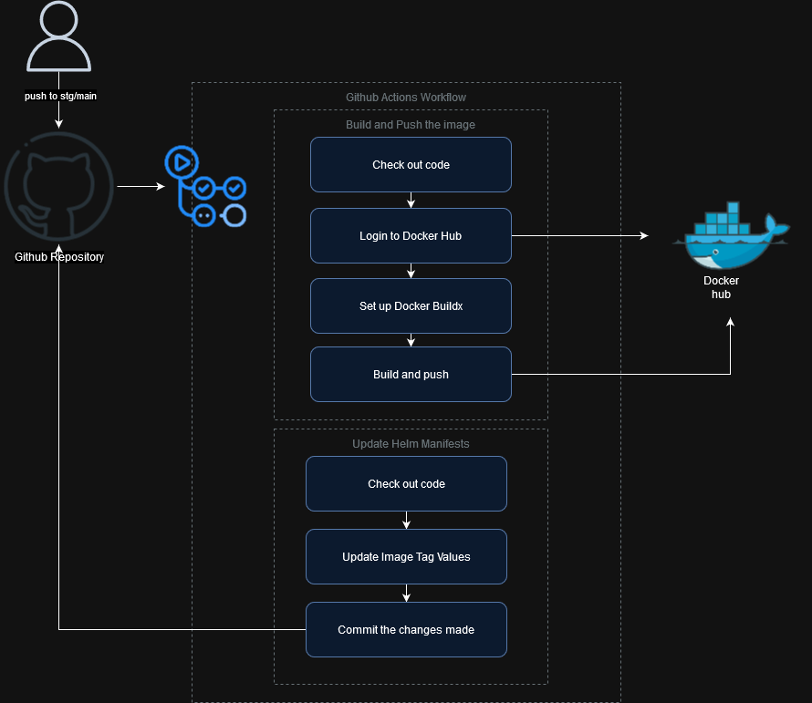

# k8s-kantox-challenge-kubeops

## Overview

This project implements a Kubernetes cluster using Minikube, configured with ArgoCD to adopt a GitOps approach. The setup includes two ArgoCD applications: one for the staging (stg) environment and another for the production (prd) environment. These applications are configured as templates in the `argocd` directory. 

- The stg application monitors changes in the `stg` branch in the GitHub repository.
- The prd application monitors changes in the `main` branch in the GitHub repository.

In the GitHub repository, there's a directory called `chart` where a Helm chart is configured as a template. Additionally, two different `values.yaml` files are provided, one for each environment.

The Helm chart deploys a service of LoadBalancer type and a Deployment with a ReplicaSet. This Deployment consists of a Docker image, which is a simple "hello world" application written in Node.js. Application's code and Dockerfile can be found in `src/hello-world` directory

## Architecture


The architecture of this project can be summarized as follows:

1. **Kubernetes Cluster**: Utilizes Minikube to create and manage a local Kubernetes cluster.

2. **ArgoCD**: Configured to follow the GitOps approach, ArgoCD monitors Git repositories for changes and ensures that the desired state of the cluster matches the configuration stored in the Git repository.

3. **Applications**:
   - **Staging (stg)**: Monitors changes in the `stg` branch of the GitHub repository.
   - **Production (prd)**: Monitors changes in the `main` branch of the GitHub repository.

4. **GitHub Repository**:
   - Contains a `chart` directory with a Helm chart configured as a template.
   - Provides two different `values.yaml` files, one for each environment.

5. **Helm Chart**:
   - Deploys a Service of LoadBalancer type and a Deployment with a ReplicaSet.
   - The Deployment contains a Docker image, which is a "hello world" application written in Node.js.


### GitHub Actions Workflow



This project includes a GitHub Actions workflow named "Argo CD GitOps CI/CD". This workflow is triggered on pushes to the `main` and `stg` branches, specifically when changes are made within the `src/hello-world` directory.

#### Jobs

##### `build`

- **Name**: Build and Push the image
- **Steps**:
  1. **Check out code**: Utilizes the `actions/checkout` action to fetch the repository code.
  2. **Login to Docker Hub**: Uses the `docker/login-action` action to log in to Docker Hub using the provided credentials.
  3. **Set up Docker Buildx**: Sets up Docker Buildx for building and pushing images.
  4. **Build and push**: Utilizes the `docker/build-push-action` action to build the Docker image from the Dockerfile located in `src/hello-world` directory and push it to Docker Hub. It tags the image with the SHA of the GitHub commit and the 'latest' tag.

##### `update`

- **Name**: Update Helm Manifests
- **Needs**: build (waits for the `build` job to complete)
- **Steps**:
  1. **Check out code**: Utilizes the `actions/checkout` action to fetch the repository code.
  2. **Update Image Tag Values**: If the trigger is from the `main` branch, it updates the `values_prd.yaml` file in the `chart` directory with the new image tag.
  3. **Update Image Tag Values for Staging**: If the trigger is from the `stg` branch, it updates the `values_stg.yaml` file in the `chart` directory with the new image tag.
  4. **Commit the changes made**: Commits the changes made to the respective values files and pushes them back to the repository. It sets the user name and email globally, commits the changes with a message, and pushes the changes to the repository.

This workflow ensures that the Docker image is built and pushed to Docker Hub upon code changes in the specified directory and updates the Helm manifest files accordingly for both staging and production environments.

## Prerequisites

- **Minikube**: v1.32.0
  - Kubernetes: v1.28.3
  - Docker: 24.0.7
- **Helm**: v3.14.0
- Docker hub account

## Setup

1. **Clone or Fork the Repository**:
```bash
git clone https://github.com/dgtvlz/k8s-kantox-challenge-kubeops
```

2. **Create DockerHub Access Token**:
Generate a DockerHub access token from your DockerHub account settings.

3. **Set Up GitHub Secrets**:
In your GitHub repository, navigate to Settings > Secrets and add the following secrets:
- `DOCKERHUB_USERNAME`: Your DockerHub username
- `DOCKERHUB_TOKEN`: The DockerHub access token generated in step 2.

4. **Configure GitHub Actions Permissions**:
Navigate to your repository's Settings > Actions > General > Workflow permissions and give read and write permissions to actions.

5. **Start Minikube**:
Start Minikube with the desired configuration.

6. **Install ArgoCD**:
```bash
kubectl create namespace argocd
kubectl apply -n argocd -f https://raw.githubusercontent.com/argoproj/argo-cd/stable/manifests/install.yaml
```

7. **Verify ArgoCD Installation**:
Ensure ArgoCD is functioning correctly:
```bash
kubectl get all -n argocd
```

8. **Access ArgoCD Dashboard**:
- Retrieve the admin password:
  ```
  kubectl -n argocd get secret argocd-initial-admin-secret -o jsonpath="{.data.password}" | base64 -d; echo
  ```
- Forward the port or use Minikube to access the dashboard:
  ```
  minikube service argocd-server --url -n argocd
  ```
- Open a web browser and navigate to the provided URL. Log in using the `admin` username and password obtained from the secret.

9. **Ensure Branches Exist**:
 Make sure both branches `stg` and `main` exist in your repository.

10. **Modify Git Config**:
 Modify the git config in the "Commit the changes made" step in `.github/workflows/gitops.yaml` to match your details.

11. **Modify Repository Name**:
 Update the repository name in `chart/values_prd.yaml` and `chart/values_stg.yaml` to use your DockerHub ID.

12. **Trigger GitHub Actions Workflow**:
 Trigger the GitHub Actions workflow on both branches (`stg` and `main`).

13. **GitHub Actions Workflow Validation**:
 Validate in Dockerhub that a new version of the Docker image was submitted.
 Validate that the `chart/values_prd.yaml` and `chart/values_stg.yaml` files were updated by the pipeline with the new tag.

14. **Install Staging App**:
 Inside the `argocd` directory, install the staging app:
 ```
 helm install argocd-app-stg -f values_stg.yaml .
 ```

15. **Install Production App**:
 Also inside the `argocd` directory, install the production app:
 ```
 helm install argocd-app-prd -f values_prd.yaml .
 ```

16. **Review ArgoCD Dashboard**:
 Once the applications are installed, review the ArgoCD dashboard to ensure the applications are created successfully.

17. **Validate Staging Environment Deployment**:
 Execute the following command to validate the staging environment deployment:
 ```
 kubectl get all -n stg
 ```

18. **Validate Production Environment Deployment**:
 Execute the following command to validate the production environment deployment:
 ```
 kubectl get all -n prd
 ```

19. **Validate Staging Service**:
 Once all the staging components are running, run the following command to get the URL of the hello-world staging service:
 ```
 minikube service hello-world --url -n stg
 ```
 Access the URL to validate the hello-world staging service.

20. **Validate Production Service**:
 Once all the production components are running, run the following command to get the URL of the hello-world production service:
 ```
 minikube service hello-world --url -n prd
 ```
 Access the URL to validate the hello-world production service.

## Future Improvements

